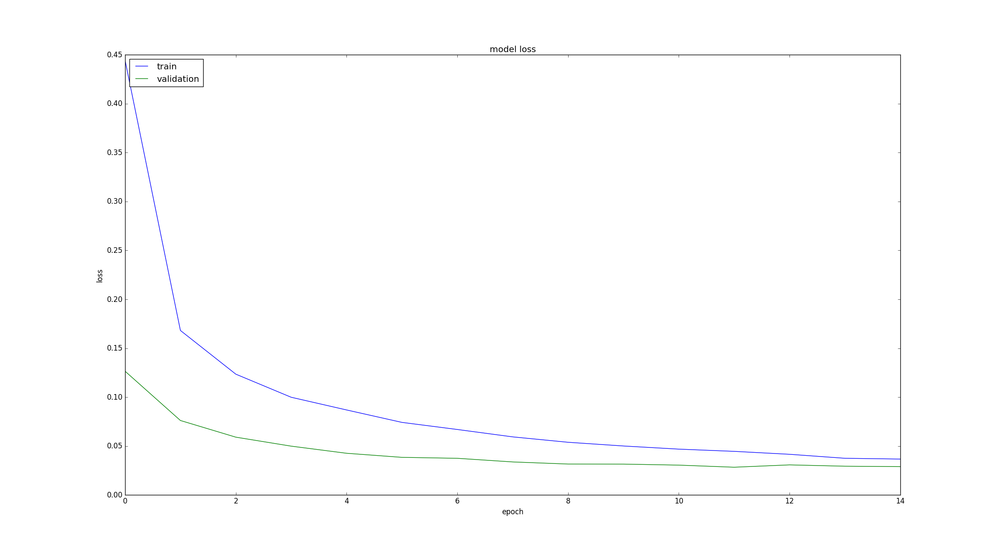
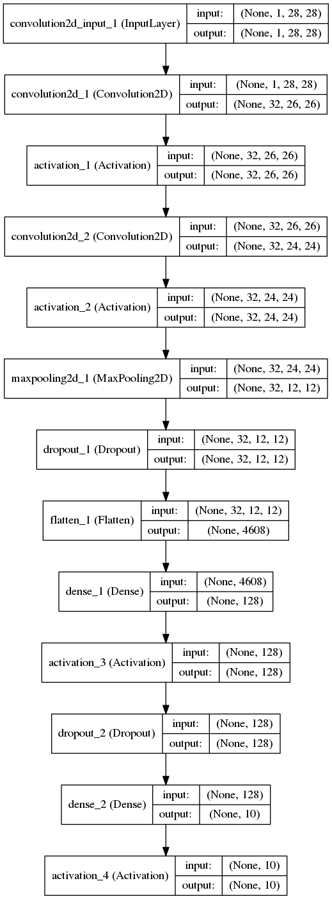

# Classify handwritten digits using the famous MNIST data

Training data consists of 60000 images of shape 28x28. Validation data contains 10000 images of shape 28x28. Datasets contains handwritten digits from 0-9. Dataset is taken from [MNIST Dataset](http://yann.lecun.com/exdb/mnist/index.html). Model achieves 98.91%-99.11% accuracy with loss of 0.0284 on validation data. Model loss graph can be seen as follow, training and validation loss is plotted againts epochs in the graph,

Convolutional model can be visualiased as follows,

  

